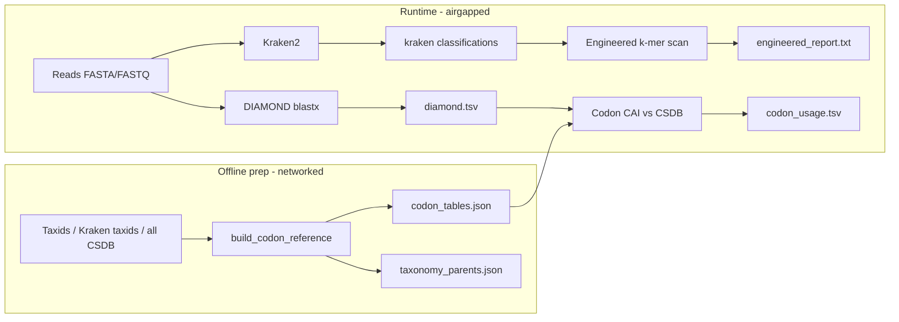

# PlasmidScreen Design Specification

This document defines expected inputs, outputs, and data contracts for engineered DNA screening, DIAMOND-based codon adaptation analysis, and the offline codon reference build.

## Overview



| Phase | Network | Entry point |
|-------|---------|-------------|
| Reference build | Required | `build_codon_reference()` / `python plasmidScreen.py build` |
| Full screening | Not required | `run_screen()` / `python plasmidScreen.py screen` |
| Codon-only | Not required | `analyze_codon_adaptation()` |

---

## 1. Inputs

### 1.1 Read sequences (FASTA / FASTQ)

| Property | Requirement |
|----------|-------------|
| Formats | `.fa`, `.fasta`, `.fq`, `.fastq` (suffix-based detection) |
| Encoding | Nucleotides A/C/G/T (case-insensitive; uppercased internally) |
| Read IDs | Must match Kraken2 column 2 and DIAMOND `qseqid` (first token in FASTA header) |

**Example FASTA**

```text
>read_natural_1
ATGAAATTTAAATAG
>read_synthetic_1
ATGAAATTTAAATAG
```

### 1.2 Kraken2 raw output (engineered k-mer scan)

Produced with minimizer data enabled (required for the engineered scan):

```bash
kraken2 --db <DB> --report-minimizer-data --output <kraken.out> \
  --use-names <reads.fa> --threads <N>
```

| Column (0-based) | Field | Description |
|------------------|-------|-------------|
| 0 | Status | `C` classified, `U` unclassified |
| 1 | Sequence ID | Read identifier (matches FASTA) |
| 2 | TaxID | NCBI taxonomy ID (`0` if unclassified) |
| 3 | Length | Sequence length (bp) |
| 4…n-2 | Optional | Additional Kraken fields |
| n-1 (last) | K-mer blocks | Run-length taxid assignments (see below) |

**K-mer block format (last column)**

Space-separated tokens: `TAXID:COUNT`

- Each token assigns `COUNT` consecutive k-mers (Kraken k=21 minimizers) the given taxonomy.
- `A:COUNT` marks ambiguous minimizers (handled as taxid `-1` internally).
- Engineered detection targets taxid **32630** in a sliding window.

**Example line**

```text
C	read_natural_1	562	100	0:35	562:30
```

By default the workflow runs Kraken2 in-process and keeps classifications in memory. Use `--kraken-output-path` with `--debug-write-kraken-out` to persist them, or `--no-run-kraken` to load a saved file.

### 1.3 Kraken2 database (engineered screen)

| Property | Description |
|----------|-------------|
| Path | Directory passed as `kraken_db` (CLI positional argument) |
| Usage | Local Kraken2 index; must include engineered taxon minimizers (taxid 32630) |

### 1.4 DIAMOND protein database (codon adaptation)

| Property | Description |
|----------|-------------|
| Format | DIAMOND database (`.dmnd`), e.g. UniRef with taxonomy |
| Usage | `diamond blastx` with `--min-orf` on reads; ORF coordinates from `qstart`/`qend`, host from `staxids` |
| Outfmt 6 columns | `qseqid sseqid qstart qend pident length evalue bitscore staxids sscinames` |

Precomputed TSV can be saved (`--debug-write-diamond-out`) and reloaded (`--no-run-diamond` + `--diamond-output-path`) for codon-only reruns.

### 1.5 Codon usage reference (pre-built, airgapped)

Directory (default: `~/.local/share/PlasmidScreen/codon_usage/`):

| File | Required | Description |
|------|----------|-------------|
| `codon_tables.json` | Yes | Per-taxid codon relative frequencies |
| `taxonomy_parents.json` | No | NCBI `taxid → parent_taxid` for lineage fallback |

**`codon_tables.json` schema**

```json
{
  "<taxid>": {
    "source": "csdb",
    "scientific_name": "optional string",
    "frequencies": {
      "TTT": 0.18,
      "TTC": 0.42
    }
  }
}
```

- Keys: DNA codons (T not U), sense codons only used for CAI.
- Frequencies: CSDB synonymous **Fraction** (0–1 per amino acid), used for Sharp & Li CAI weights.

**`taxonomy_parents.json` schema**

```json
{
  "562": "561",
  "561": "543"
}
```

### 1.6 Build-time inputs (`build_codon_reference`)

| Input | Description |
|-------|-------------|
| *(none)* | CLI `build` with no taxid flags imports **every** taxid in the CSDB archive |
| `csdb_archive` | Path to `codonstatsdb_March2022.tar.gz` (default: PlasmidScreen data dir) |
| `download_csdb` | If true and archive missing, download ~5.2 GB from [CSDB](http://codonstatsdb.unr.edu/) |
| `taxids` / `taxids_file` | Subset of NCBI taxonomy IDs to import |
| `kraken_output` | Optional; union of classified taxids from a Kraken file (build helper only) |
| `include_taxonomy` | If true, download NCBI taxdump and write `taxonomy_parents.json` |
| `gene_set` | CSDB table: `nuclear` (default), `ribosomal`, `mitochondrial`, or `plastid` |

**Data source:** [Codon Statistics Database](http://codonstatsdb.unr.edu/) (RefSeq representative genomes, March 2022 snapshot). Build extracts `data/<taxid>/nuclear_codon_statistics.tsv` per species. Lineage resolution maps DIAMOND/Kraken taxids to the nearest CSDB entry via NCBI taxonomy.

---

## 2. Configuration parameters

### 2.1 Engineered k-mer scan

| Parameter | CLI flag | Default | Description |
|-----------|----------|---------|-------------|
| `window_size` | `--window_size` | 200 | Nucleotide window for k-mer voting |
| `engineered_kmer_threshold` | `--threshold` | 25 | Min engineered (32630) k-mers in window to label **Synthetic** |
| `threads` | `--threads` | 4 | Kraken2 threads (when `run_kraken=True`) |

Effective k-mers per window: `window_size - 21 + 1` (Kraken k=21 minimizers in window logic).

### 2.2 Codon adaptation (DIAMOND + CSDB)

| Parameter | CLI flag | Default | Description |
|-----------|----------|---------|-------------|
| `diamond_db` | `--diamond-db` | — | Required when codon enabled and DIAMOND runs |
| `diamond_threads` | `--diamond-threads` | same as `--threads` | DIAMOND worker threads |
| `diamond_output_path` | `--diamond-output-path` | — | Save/load DIAMOND outfmt 6 TSV |
| `run_diamond` | `--run-diamond` / `--no-run-diamond` | true | Run blastx vs load TSV |
| `codon_usage_dir` | `--codon-usage-dir` | user data dir | Pre-built reference directory |
| `include_read_ids` | (library) | all DIAMOND hits | Full screen passes Natural read IDs only |
| `codon_cai_engineered_threshold` | `--codon-cai-threshold` | — | Optional low-CAI engineered flag |

---

## 3. Outputs

### 3.1 Engineered screening report (TSV-like text)

**Path:** user-provided engineered report path (e.g. `report.txt`)

| Column | Type | Meaning |
|--------|------|---------|
| Label | `Natural` \| `Synthetic` | Per-read engineering label |
| Read_ID | string | Read identifier |
| Methods | string | Method tags (e.g. `engineered_kmer_scan`) |
| EngineeredKmerMaxInWindow | int | Max engineered-kmer count observed in any window |
| KmerThreshold | int | Threshold used to label Synthetic |
| WindowSize | int | Window size used for scanning |

**Example**

```text
Label	Read_ID	Methods	EngineeredKmerMaxInWindow	KmerThreshold	WindowSize
Natural	read_natural_1		0	25	200
Synthetic	read_synthetic_1	engineered_kmer_scan	35	25	200
```

### 3.2 Codon usage report (TSV)

**Path:** `--codon-usage-output` (optional)

Only **Natural** reads are scored when run via full `screen` workflow.

| Column | Type | Description |
|--------|------|-------------|
| Read_ID | string | Read identifier |
| CDS_Strand | `+` / `-` | Strand of selected ORF (from DIAMOND coordinates) |
| CDS_Range | string | `start-end` (0-based half-open on read) |
| Host_TaxID | string | Dominant DIAMOND `staxids` taxid for the read |
| Reference_TaxID | string | CSDB taxid used for CAI after lineage resolution |
| CDS_Len_bp | int | ORF length in bp |
| CAI_vs_Host | float or `NA` | Codon Adaptation Index vs host reference (0–1) |
| Codon_CAI_Threshold | float | Present only when `--codon-cai-threshold` is set |
| Engineered_By_Codon_CAI | bool or `NA` | Present only when codon-CAI flagging is enabled |

**Example**

```text
Read_ID	CDS_Strand	CDS_Range	Host_TaxID	Reference_TaxID	CDS_Len_bp	CAI_vs_Host
read_natural_1	+	0-99	562	562	99	0.7234
```

### 3.3 Library return types

#### `ScreenResult`

| Field | Type | Description |
|-------|------|-------------|
| `engineered_scan` | `EngineeredScanResult` | All read labels and counts |
| `codon_adaptation` | `list[CodonAdaptationResult]` | Natural reads only (if codon enabled) |
| `per_read` | `list[ReadFlagDetail]` | Per-read method attribution and evidence |
| `engineered_report_path` | `Path \| None` | Written engineered report |
| `codon_usage_report_path` | `Path \| None` | Written codon TSV |
| `diamond_output_path` | `Path \| None` | Saved or loaded DIAMOND TSV path |

#### `CodonAdaptationResult`

| Field | Type | Description |
|-------|------|-------------|
| `read_id` | str | Read ID |
| `cds_strand` | str | `+` or `-` |
| `cds_start`, `cds_end` | int | ORF coordinates from merged DIAMOND hits |
| `host_taxid` | str | Taxid from DIAMOND `staxids` (majority over hits) |
| `reference_taxid` | str \| None | CSDB table taxid after lineage resolve |
| `cds_len_bp` | int | ORF length in bp |
| `cai_vs_host` | float \| None | CAI score |
| `host_taxid_method` | str \| None | e.g. `"diamond"` |

#### `ReadEngineeringLabel`

| Field | Type | Values |
|-------|------|--------|
| `read_id` | str | |
| `label` | str | `"Natural"` \| `"Synthetic"` |

#### `ReadFlagDetail`

Per-read attribution and evidence for engineered calls.

| Field | Type | Description |
|-------|------|-------------|
| `read_id` | str | Read ID |
| `kmer_label` | `"Natural"` \| `"Synthetic"` | Label from engineered k-mer scan |
| `engineered_by_kmer_scan` | bool | True if engineered k-mer scan flagged |
| `engineered_kmer_max_in_window` | int \| None | Max engineered-kmer count observed |
| `engineered_kmer_threshold` | int \| None | Threshold used |
| `engineered_kmer_window_size` | int \| None | Window size used |
| `cai_vs_host` | float \| None | CAI score vs host |
| `codon_cai_threshold` | float \| None | Threshold used for codon CAI flagging |
| `engineered_by_codon_cai` | bool \| None | True if CAI < threshold |

#### `BuildCodonReferenceResult`

| Field | Type | Description |
|-------|------|-------------|
| `data_dir` | Path | Output directory |
| `taxids_requested` | list[str] | Input taxid set |
| `taxids_added` | list[str] | Newly fetched |
| `taxids_skipped` | list[str] | Already present |
| `taxids_failed` | list[str] | CSDB import failed (taxid not in archive / no lineage match) |

---

## 4. Behavioural rules

### 4.1 Engineered vs Natural

- Each classified read with valid k-mer block data receives **Synthetic** if sliding-window count of taxid `32630` ≥ threshold; otherwise **Natural**.
- Unclassified reads (`U`) are still listed in the engineered report if present in Kraken output; codon analysis skips reads without DIAMOND host/ORF assignment.

### 4.2 Codon analysis gating

- Full pipeline: codon CAI runs **only** for reads labeled **Natural** by the k-mer scan.
- Standalone `analyze_codon_adaptation`: scores all reads with DIAMOND hits unless `include_read_ids` is set.
- If zero Natural reads, codon output is empty (no TSV unless path set with zero rows).

### 4.3 Airgapped / reference errors

| Condition | Exception |
|-----------|-----------|
| `codon_tables.json` missing | `CodonReferenceNotFoundError` |
| Host taxid not in store (no lineage match) | `MissingCodonReferenceError` |

No network access occurs during `analyze_codon_adaptation` or `run_screen` codon steps.

### 4.4 CAI computation

- **ORF selection:** DIAMOND blastx with `--min-orf`; merge overlapping hit intervals per read; choose longest merged interval; slice read sequence for CAI.
- **Host taxid:** majority of `staxids` across hits for the read.
- **Reference:** walk NCBI parents in `taxonomy_parents.json` until a `codon_tables.json` entry exists.
- **Weights:** Sharp & Li adaptiveness (per-codon weight / max within synonymous family).
- **CAI:** geometric mean of codon weights across in-frame triplets in the ORF slice.

---

## 5. CLI command summary

| Command | Purpose |
|---------|---------|
| `plasmidScreen.py screen` | Kraken (optional) + engineered scan + codon usage (DIAMOND) |
| `plasmidScreen.py build` | Offline codon reference build from CSDB |

### `screen` arguments

```text
screen FASTA_FILE OUTPUT_REPORT_PATH KRAKEN_DB_PATH
  --window_size INT
  --threshold INT
  --codon-usage-output PATH
  --codon-usage-dir PATH
  --codon-cai-threshold FLOAT
  --diamond-db PATH
  --diamond-threads INT
  --diamond-args TEXT
  --diamond-output-path PATH
  --debug-write-diamond-out
  --run-diamond / --no-run-diamond
  --skip-codon-usage
  --kraken-output-path PATH
  --debug-write-kraken-out
  --debug-write-kraken-report
  --run-kraken / --no-run-kraken
  --threads INT
```

### `build` arguments

```text
build
  --output-dir PATH
  --taxids "9606,511145"
  --taxids-file PATH
  --skip-taxonomy
  --taxdump-dir PATH
  --csdb-archive PATH
  --no-download-csdb
  --gene-set nuclear|ribosomal|mitochondrial|plastid
```

Note: `--kraken-output` for taxid subset during build is available via the library `build_codon_database(kraken_output=...)` API.

---

## 6. Library API summary

```python
from plasmidScreen import (
    build_codon_reference,       # -> BuildCodonReferenceResult
    build_codon_database,        # convenience wrapper for build CLI
    analyze_codon_adaptation,    # -> tuple[list[CodonAdaptationResult], Path | None]
    run_screen,                  # -> ScreenResult
    write_codon_adaptation_tsv,  # -> tuple[str, list[CodonAdaptationResult]]
    taxids_from_kraken_output,   # taxids for reference subset builds
    CodonUsageStore,
    default_codon_usage_dir,
)
```

Recommended airgapped workflow:

1. Networked: `build_codon_reference(dir)` or subset taxids / Kraken-derived taxids.
2. Copy `dir` (and DIAMOND DB if needed) to the airgapped environment.
3. Run `run_screen(reads, kraken_db, diamond_db=..., codon_usage_dir=dir)` or codon-only `analyze_codon_adaptation(reads, diamond_db=..., codon_usage_dir=dir)`.
